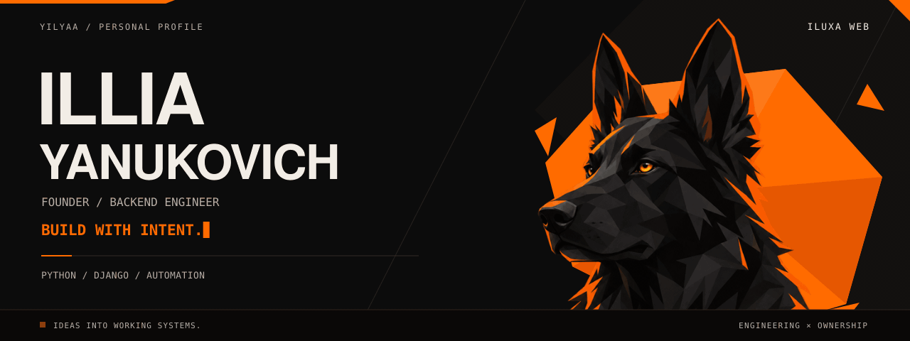
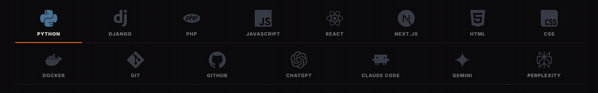
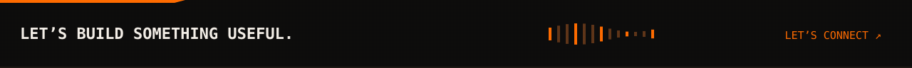

  <picture>
    <source media="(prefers-reduced-motion: reduce)" srcset="./assets/header-still.png">
    
  </picture>

  
  

  <em>Hands-on with the code. Accountable for the outcome.</em>

---

  I build products end to end: the interface people use, the system behind it, and the release that puts it in their hands.  
  I also run the part that is not code. Working out what the thing actually needs to do, setting the order it gets done in, and deciding when it is ready to go out.  
  A lot of the work is taking something that currently runs on people and making it run on its own.

  

### What I work with

  <picture>
    <source media="(prefers-reduced-motion: reduce)" srcset="./assets/tech-still.png">
    
  </picture>

  

 

<a href="mailto:info@iluxa-web.com">
  <picture>
    <source media="(prefers-reduced-motion: reduce)" srcset="./assets/footer-still.png">
    
  </picture>
</a>
