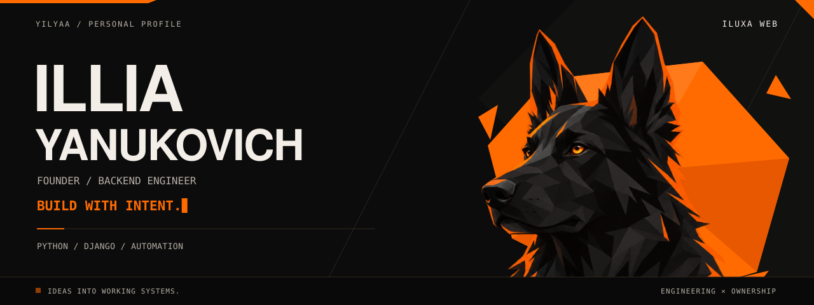
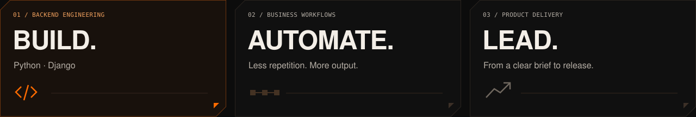
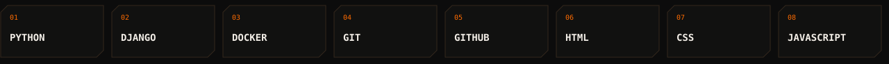
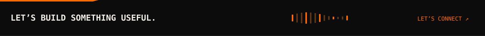

  

  <a href="https://www.linkedin.com/in/illia-yanukovich/">LinkedIn ↗</a>
  &nbsp; / &nbsp;
  <a href="https://github.com/YIlyaA?tab=repositories">Explore my code ↗</a>
  &nbsp; / &nbsp;
  <a href="./README.md">Animated version ↗</a>

### The person behind the code

I'm **Illia**, Founder & CEO of **ILUXA WEB** and a backend developer working with **Python and Django**.

I build web products and automate business workflows. My work connects the technical details with the bigger picture: what needs to be built, why it matters, and how to get it into people's hands.

**Hands-on with the code. Responsible for the outcome.**

  

### My toolkit

  

<strong>A little more about how I work</strong>

- **Build around a real need.** Start with the problem, then choose the tools.
- **Make the routine repeatable.** Automate tasks that don't need a human every time.
- **Keep the system understandable.** Code should be workable for the next person, too.
- **Own the delivery.** Connect business priorities, design, and implementation.

 

